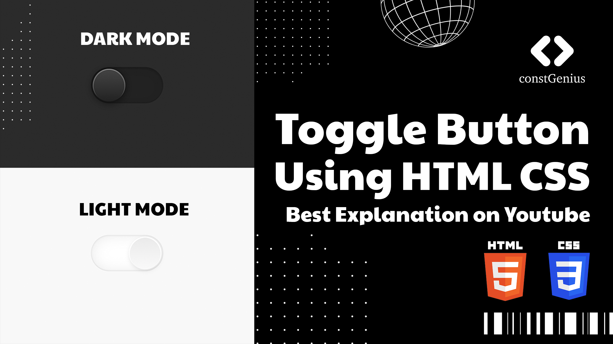

# Toggle Button Using HTML CSS | Dark and Light Mode

Learn how to create a dynamic and user-friendly toggle button to switch between dark and light modes seamlessly on your website. This tutorial provides a step-by-step guide on using HTML and CSS to design an elegant and intuitive toggle button, enabling users to adjust the website's appearance based on their preferences. Enhance the user experience by incorporating this simple but effective feature, ensuring comfortable visibility in different lighting environments.

